# Vibe Design Arena

Build three genuinely different frontend redesigns from one Git baseline, inspect them as complete rendered candidates, and let the user choose one whole winner.

Vibe Design Arena is a Codex Skill for high-stakes frontend redesign work. It uses isolated Git worktrees to protect each direction, a scripted lifecycle to bind decisions and evidence to the right commit, and a human selection gate that preserves design coherence: no mix-and-match, cherry-picking, or automatic winner.

## What it guarantees

- **Three real directions.** Each candidate starts from the same final `BASE_SHA` on `style-a`, `style-b`, and `style-c`; changing only palette, typography, radius, or dark mode does not qualify.
- **Approval before implementation.** The user sees and approves the complete three `DESIGN_BRIEF.md` files before worktrees are created.
- **Evidence-bound qualification.** A candidate needs brief integrity, declared validation, automated QA, a main-agent visual review, and a direction-consistency review.
- **The user chooses.** Qualification establishes eligibility only. It never scores, ranks, or picks the winner.
- **Safe conclusion.** Only the selected branch is merged; worktrees are removed only after post-merge validation; all three candidate branches remain available.

## When to use it

Use this Skill when an existing product needs three competing, whole-version frontend redesign directions and the user wants to select one after comparison.

Do not use it for a routine UI edit, a component tweak, or a request to combine favorite fragments from several directions. Pick one coherent version first; run a separate redesign afterward if further exploration is wanted.

## The Arena flow

```mermaid
flowchart LR
  A[Clean product baseline] --> B[Three approved briefs]
  B --> C[Three isolated Git worktrees]
  C --> D[Build, preview, and collect evidence]
  D --> E[QA plus two human reviews]
  E --> F[All three qualify]
  F --> G[User chooses one whole version]
  G --> H[Merge and validate winner]
  H --> I[Remove worktrees; retain all branches]
```



The controller records the corresponding lifecycle as:

```text
preflight -> briefs-approved -> worktrees-ready -> building
          -> previews-ready -> qualifying -> selection-ready
          -> selected -> merged -> cleaned -> complete
```

## Quick start

This repository is a Codex Skill rather than a package to install. Load it from its directory, inspect the target product, and follow the stage-specific instructions in [SKILL.md](SKILL.md).

For a new Arena run, use an absolute state path outside the product repository. The controller is the only permitted writer of `arena-state.json`.

```powershell
$skillRoot = "<absolute path to vibe-design-arena>"
$arena = Join-Path $skillRoot 'scripts\arena.ps1'
$state = "<absolute ARENA_RUN_ROOT>\records\arena-state.json"

powershell -ExecutionPolicy Bypass -File $arena preflight `
  -State $state `
  -Repo "<absolute product Git root>" `
  -SkillRoot $skillRoot `
  -Config "<structured arena configuration.json>"
```

Before every mutating command, run `status` and pass its current `stateRevision` as `-ExpectedRevision`. If preflight proposes a `.gitattributes` patch, show the exact patch to the user and obtain approval before rerunning with `-ApplyAttributes`.

The full command sequence, configuration shape, recovery rules, and publication behavior live in [references/arena-lifecycle.md](references/arena-lifecycle.md).

## Qualification, not ranking

Each candidate must pass these five independent gates before it can enter the comparison view:

1. `briefIntegrity`
2. `validation`
3. `automatedQa`
4. `mainAgentVisualReview`
5. `directionConsistencyReview`

Automated QA is deliberately narrow and declarative. It validates configured browser scenarios across mobile, tablet, desktop, and an explicitly labelled equivalent-200-percent layout proxy. It does not claim to decide whether a design is compelling; the main agent must inspect current screenshots and sign both human reviews.

Read [references/arena-scorecard.md](references/arena-scorecard.md), [references/visual-quality-bar.md](references/visual-quality-bar.md), [references/interaction-quality-bar.md](references/interaction-quality-bar.md), and [references/qa-configuration.md](references/qa-configuration.md) before qualifying a candidate.

## Design references

The reference library exists to make the three options difficult to choose between for the right reason: each should be a coherent proposition, not a safe default with different decoration.

- [Direction Brief Standard](references/direction-brief.md): the complete contract every approved brief must satisfy.
- [Anti-Slop](references/anti-slop.md): challenges generic gradients, card walls, terminal cosplay, decorative data, and other unjustified defaults.
- [Finance and Data domain pack](references/domain-packs/README.md): shared judgments and three separately distributed direction calibrations for finance/data products.

## Repository layout

```text
SKILL.md                         Workflow contract and responsibility split
references/                      Design standards and operating guides
references/domain-packs/         Domain-specific calibration
scripts/arena.ps1                Stateful Arena controller
scripts/arena-integrity.ps1      Snapshot and brief-integrity utility
scripts/arena-qa.mjs             Declarative Playwright and axe QA runner
scripts/schemas/                 State, builder result, and QA contracts
scripts/tests/                   Lifecycle and QA regression coverage
```

## Requirements and verification

- Git and PowerShell are required for the lifecycle controller.
- Node.js is required for the bundled QA runner and its unit test.
- Playwright (or `playwright-core`), `axe-core`, and a Chromium runtime are required only to obtain an automated-QA `PASS`. They are never installed automatically.

Run the available regression checks from the repository root:

```powershell
powershell -ExecutionPolicy Bypass -File .\scripts\tests\phase1-smoke.ps1
powershell -ExecutionPolicy Bypass -File .\scripts\tests\phase2-smoke.ps1
python -X utf8 "<CODEX_HOME>\skills\.system\skill-creator\scripts\quick_validate.py" "<absolute skill root>"
```

## Git evolution

| Date (UTC+8) | Commit | Change |
| --- | --- | --- |
| 2026-07-12 | `a996ba9` | Initial three-worktree, whole-winner Skill. |
| 2026-07-14 | `be6ee06` | Added reference-driven design-quality gates. |
| 2026-07-14 | `8f1d29b` | Added the first design-quality reference library. |
| 2026-07-14 | `fc73b74` | Isolated domain briefs so builders receive only their assigned direction. |
| 2026-07-14 | `86c4ea3` | Hardened frozen references, briefs, merge validation, and branch-retention rules. |
| 2026-07-14 | `f3134b1` | Clarified run records and the approved-brief contract. |
| 2026-07-15 | `0a553bf` | Added the scripted lifecycle state machine, integrity tools, schemas, and smoke coverage. |
| 2026-07-15 | `fbd17af` | Added declarative browser QA and the five-gate qualification flow. |
| 2026-07-15 | `d9125f6` | Refocused the main workflow and moved operational detail into dedicated references. |

## Contributing

Keep the non-negotiable three-version flow intact. In particular, do not add composite-selection logic, auto-selection, branch deletion during cleanup, or manual edits to `arena-state.json`.

For changes to scripts or schemas, update the relevant regression coverage and run the verification commands above. For changes to design guidance, preserve the distinction between universal references, main-agent-only cross-direction material, and builder-facing inputs.

## License

No license is currently declared in this repository.
